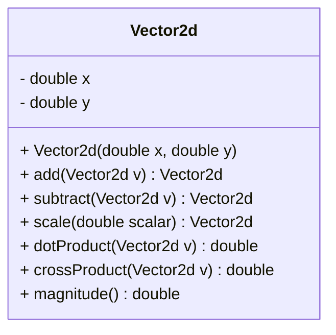

# C: Memory, Pointers, and Objects

<div style="display: flex; justify-content: flex-end;">
    <blockquote>
        <p>
            A brief introduction to
            C memory, pointer, and object-oriented programing
            <s>for Physics students</s>.
        </p>
    </blockquote>
</div>

This is an attempt to deliver a brief introduction of a few memory-related concepts for *C Language* beginners, with malformed grammar and ridiculous mistakes of spellings unavoidably included.

本文将尝试<s><small>简短地</small></s>介绍 *C语言* 中的几个内存相关概念。

> 关于「简短」：当我没说。

---

## Contents

- [C: Memory, Pointers, and Objects](#c-memory-pointers-and-objects)
  - [Contents](#contents)
  - [Prologue: Before the Introduction](#prologue-before-the-introduction)
    - [Preprocessing, Compile-time, Linking and Runtime Errors](#preprocessing-compile-time-linking-and-runtime-errors)
      - [Pre-processing:](#pre-processing)
        - [1. Missing include files:](#1-missing-include-files)
        - [2. Incorrect macro usage:](#2-incorrect-macro-usage)
        - [3. Conditional compilation errors:](#3-conditional-compilation-errors)
      - [Compile-time:](#compile-time)
        - [1. Syntax errors:](#1-syntax-errors)
        - [2. Type errors:](#2-type-errors)
        - [3. Undeclared variables:](#3-undeclared-variables)
        - [4. Incorrect function arguments:](#4-incorrect-function-arguments)
      - [Linking:](#linking)
        - [1. Undefined symbols:](#1-undefined-symbols)
        - [2. Multiple definitions:](#2-multiple-definitions)
      - [Runtime:](#runtime)
        - [1. Segmentation fault:](#1-segmentation-fault)
        - [2. Stack overflow:](#2-stack-overflow)
        - [3. Floating point exceptions:](#3-floating-point-exceptions)
  - [The Static Memory Model of C](#the-static-memory-model-of-c)
    - [Bytes and Static Memory Model](#bytes-and-static-memory-model)
    - [Memory Location](#memory-location)
      - [Memory Segments](#memory-segments)
    - [Memory Addresses](#memory-addresses)
      - [Address Types](#address-types)
    - [Memory Order](#smemory-orders)
  - [Pointers: Variables Supposed to Store Addresses](#pointers-variables-supposed-to-store-addresses)
    - [Addressing and Indirect Addressing](#addressing-and-indirect-addressing)
      - [Pointer Declaration](#pointer-declaration)
      - [Indirect Addressing](#indirect-addressing)
      - [Direct Addressing](#direct-addressing)
    - [Typing](#typing)
      - [Type of The Pointer And The Pointed-To](#type-of-the-pointer-and-the-pointed-to)
    - [Array and Pointer Arithmetics](#array-and-pointer-arithmetics)
      - [Array](#array)
      - [Pointer Arithmetics With Array Name](#pointer-arithmetics-with-array-name)
      - [Operator `[]`](#operator)
    - [Pointer as Function Parameters](#pointer-as-function-parameters)
    - [Dynamic Memory Allocation](#dynamic-memory-allocation)
      - [Allocation](#allocation)
        - [`malloc()`](#malloc)
        - [`calloc()`](#calloc)
        - [`realloc()`](#realloc)
      - [Deallocation](#deallocation)
      - [Memory Leak](#memory-leak)
      - [A Further Example on Struct](#a-further-example-on-struct)
    - [C-String](#c-string)
      - [C-Styled String](#c-styled-string)
    - [String Operation with Standard Library](#string-operation-with-standard-library)
      - [1. String length (`strlen()` and `strnlen()`)](#1-string-length-strlen-and-strnlen)
      - [2. String copy (`strcpy()` and `strncpy()`)](#2-string-copy-strcpy-and-strncpy)
      - [3. String concatenation (`strcat()` and `strncat()`)](#3-string-concatenation-strcat-and-strncat)
      - [4. String comparison (`strcmp()` and `strncmp()`)](#4-string-comparison-strcmp-and-strncmp)
      - [5. Substring search (`strstr()` and `strnstr()`)](#5-substring-search-strstr-and-strnstr)
      - [6. The Most Important: IO](#6-the-most-important-io)
        - [(1). Input using `scanf()`](#1-input-using-scanf)
        - [(2). Input using `scanf_s()`](#2-input-using-scanfs)
        - [(3). Output using `printf()`](#3-output-using-printf)
        - [(4). Output using `printf_s()`](#4-output-using-printfs)
  - [Function Pointer and Higher-Order Function](#function-pointer-and-higher-order-function)
    - [Function Pointer](#function-pointer)
      - [The Introduction](#the-introduction)
      - [Syntax and Examples](#syntax-and-examples)
      - [A More Terrifying Example](#a-more-terrifying-example)
    - [Functional](#functional)
      - [Definition](#definition)
      - [Callback](#callback)
      - [The sorting algorithms](#the-sorting-algorithms)
    - [Closure](#closure)
  - [Object-Oriented Programing in C: A Simple Glance](#object-oriented-programing-in-c-a-simple-glance)
    - [Definition for an Object](#definition-for-an-object)
    - [Instance and Class](#instance-and-class)
    - [A Simple Object Implantation in C](#a-simple-object-implantation-in-c)
      - [`Vector2d`](#vector2d)
  - [Data Structures: A Brief Introduction](#data-structures-a-brief-introduction)
    - [Vector: Array with Dynamic Length](#vector-array-with-dynamic-length)
      - [Implantation](#implantation)
    - [Linking List: Forward List](#linking-list-forward-list)
    - [Linking List: Bidirectional-Cyclone List](#linking-list-bidirectional-cyclone-list)
  - [Object-Oriented Programing in C: Polymorphism](#object-oriented-programing-in-c-polymorphism)
    - [Static Polymorphism](#static-polymorphism)
      - [Examples of Static Polymorphism in `math.h`](#examples-of-static-polymorphism-in-mathh)
      - [The `_Generic` Macro](#the-generic-macro)
    - [Dynamic Polymorphism: Not Enough!](#dynamic-polymorphism-not-enough)
      - [Dynamic Polymorphism Implantation with Silly Type Checking](#dynamic-polymorphism-implantation-with-silly-type-checking)
      - [Implantation: The `Variant`](#implantation-the-variant)
      - [Composition: A Trick of Memory](#composition-a-trick-of-memory)
      - [Inheritance: The `vtable` and Method Overriding](#inheritance-the-vtable-and-method-overriding)
      - [Virtual Inheritance: `vtable` of Base Classes](#virtual-inheritance-vtable-of-base-classes)
    - [CPython](#cpython)
  - [Epilogue: The Story of CFront](#epilogue-the-story-of-cfront)

---

## Prologue: Before the Introduction

### Preprocessing, Compile-time, Linking and Runtime Errors

Obliviously, the translation progress consists a serial of different stages, each of which may generate error(s). Thus, a clarification of their functionality is acquired.

#### Pre-processing:

The pre-processing stage is the first phase of compilation in C programming. During this stage, a preprocessor reads the source code and processes it before actual compilation starts. The preprocessor performs various operations like macro substitution, file inclusion, and conditional compilation.

For example, if you use the `#define` directive to define a macro, the preprocessor replaces all occurrences of the macro with its corresponding value. The preprocessor also processes any `#include` statements in the code, which instructs the preprocessor to include the contents of another file in the current file.

There can be pre-processing errors that occur during the pre-processing stage of compiling a C program. These errors typically involve the use of preprocessor directives that are not properly formatted or do not have the intended effect. Here are some examples of pre-processing errors:

##### 1. Missing include files:

If a source file includes a header file that cannot be found, the preprocessor will produce an error. For example:

```c
#include <missing.h> 
// error: missing.h: No such file or directory

int main() {
   return 0;
}
```

##### 2. Incorrect macro usage:

If a macro is not defined correctly or is used incorrectly, the preprocessor will produce an error. For example:

```c
#include <stdio.h>
#define MAX(a,b) ((a)>(b)?(a):(b))

int main() {
   printf("The max of two and three is %f\n", MAX(2,3,4)); 
   // error: macro "MAX" passed 3 arguments, but takes just 2
   return 0;
}
```

##### 3. Conditional compilation errors:

If a preprocessor conditional is not properly formed or is missing a required symbol definition, the preprocessor will produce an error. For example:

```c
#include <stdio.h>
#undef DEBUG
   printf("Debugging disabled\n"); 
#endif
// error: #endif without #if

int main() {
   return 0;
}
```

#### Compile-time:

The compilation stage takes place after the pre-processing stage. During this stage, the compiler reads the pre-processed source code and generates object code. The object code contains machine code that the CPU can understand. The compiler checks the syntax of the code and generates errors and warnings if it encounters any issues. The output of the compilation stage is an object file(`*.o`), which contains machine code but is not yet executable.

Examples of compile-time errors:

> In all of these cases, the errors occur during the compilation stage and prevent the program from being compiled into an object file.

##### 1. Syntax errors:

These occur when the code violates the syntax rules of the C language. For example, forgetting to close a parenthesis or a curly brace, or using an undeclared variable:

```c
int main() {
   printf("Hello World!");
   return 0;
// Error: Missing closing brace
```

##### 2. Type errors:

These occur when the type of a variable or expression is incompatible with the operation being performed on it. For example, trying to add an integer and a string:

```c
int main() {
   int a = 5;
   char b[] = "Hello";
   printf("%d%s", a+b);
   return 0;
}
// Error: Incompatible types in printf
```

##### 3. Undeclared variables:

These occur when a variable is used in the code without being declared first. For example:

```c
int main() {
   x = 5; // error: ‘x’ undeclared (first use in this function)
   return 0;
}
```

##### 4. Incorrect function arguments:

These occur when the number or type of arguments passed to a function does not match its definition. For example:

```c
#include <stdio.h>

void print_message(char* message) {
   printf("%s", message);
}

int main() {
   print_message(); 
   // error: too few arguments to function ‘print_message’
   return 0;
}
```

#### Linking:

The linker is a program that takes one or more object files and combines them into a single executable program or shared library. During Linking, the linker resolves external references and relocations, merges duplicate code and data sections and creates the final executable file. The output of this stage is an executable file that is ready to be run on the target platform.

Of cause, there are linking errors, the errors occur during the linking stage prevent the program from being linking and thus stop executable generating.

##### 1. Undefined symbols:

These occur when the linker cannot find the definition of a symbol (function or variable) that is referenced by the code. For example, forgetting to include the library that contains a function that is used in the code:

```c
#include <stdio.h>

int main() {
   printf("Hello World!");
   foo(); // undefined reference to `foo`
   return 0;
}
```

##### 2. Multiple definitions:

These occur when the linker finds multiple definitions of the same symbol in different object files. For example, defining a global variable in a header file that is included in multiple source files:

```c
// file.h
int x = 10;

// file1.c
#include "file.h"

// file2.c
#include "file.h"
int main() {
   return 0;
}
// Error: Multiple definition of `x`
```

#### Runtime:

The runtime stage is the stage at which the compiled program is executed. During this stage, the operating system loads the executable program into memory and starts executing it. The program's instructions are executed one by one, and any data used by the program is stored in memory. The runtime stage also involves interacting with input and output devices, such as keyboard and display, and performing any necessary operations on the data.

Though runtime errors won't be record in Windows, when a C program crashes due to a runtime error on Linux, it may produce a message like "Core dumped" or "Segmentation fault (core dumped)". This means that the program has attempted to access memory that it is not allowed to access, and the operating system has terminated the program and produced a core dump file, which can be analyzed to determine the cause of the error.

Here are some examples of runtime errors that can cause a core dump:

##### 1. Segmentation fault:

This occurs when a program tries to access a memory location that it is not allowed to access, usually because it is outside the program's memory space. This can happen when a program dereferences a null pointer, accesses an uninitialized pointer, or overflows a buffer. For example:

```c
int main() {
   int* ptr = NULL;
   *ptr = 5; // segmentation fault
   return 0;
}
```

##### 2. Stack overflow:

This occurs when a program uses more stack space than is available, usually because of a function call chain that is too deep or an excessively large array allocation on the stack. For example:

```c
void f() {
   int arr[1000000]; // allocate a large array on the stack
   f(); // call itself recursively
}

int main() {
   f(); // stack overflow
   return 0;
}
```

##### 3. Floating point exceptions:

This occurs when a program attempts to perform an illegal floating-point operation, such as dividing by zero, taking the square root of a negative number, or producing a result that is too large or too small to represent. For example:

```c
#include <math.h>

int main() {
   double x = -1.0;
   double y = sqrt(x); // domain error: square root of negative number
   return 0;
}
```

## The Static Memory Model of C

### Bytes and Static Memory Model

In C programming, memory refers to the space in the computer's memory system that is allocated for storing data during program execution. Memory is essential to store variables, data structures, and other program-related information.

Memory in C is organized into individual bytes, and each byte is assigned a unique memory address. These addresses can be used to access and manipulate data stored in memory.

> Beaware, a `byte` can be `9 bit` or `16 bit`. `1 byte == 8 bits` is not written in Standard.

### Memory Location

#### Memory Segments

A typical C program has four main memory segments:

1. **Text Segment (also known as Code Segment):** This segment contains the executable instructions of the program. **The code segment is read-only** and any attempt to modify it will result in a segmentation fault error.

2. **Data Segment:** This segment is further divided into two parts:

- **Initialized Data Segment:** This segment contains static and global variables that have an initial value set in the source code. This data is stored in a read-write area of memory.
- **Uninitialized Data Segment** (also known as **BSS Segment**): This segment contains static and global variables that are uninitialized or initialized to zero. This data is also stored in a read-write area of memory.

3. **Stack Segment:** This segment is used for storing **local variables and function parameters**. It is a dynamic memory segment and grows downwards.

4. **Heap Segment:** This segment is used for **dynamic memory allocation** during program execution. Memory is allocated on demand from the heap segment, and deallocated when it is no longer needed. The heap segment grows upwards and is managed by the program's memory allocation functions **such as `malloc()` and `free()`**.

### Memory Addresses

#### Address Types

In computer systems, a memory address is a unique identifier that specifies the location of a specific byte in memory. Every byte of memory has its own unique address, and these addresses are used to access and manipulate data stored in memory.

While **physical addresses** represent the actual location of data in physical memory, **virtual addresses** are generated by the *operating system* and used by programs to access memory. The use of virtual memory provides several benefits, including memory protection, efficient memory usage, and the ability to run multiple programs simultaneously.

> The actual addresses we deal with in C are virtual addresses.

### <s>Memory Order</s>

Memory order in C refers to the order in which memory operations occur in parallel programming.

In parallel programming, multiple threads can access and modify the same memory location simultaneously, which can result in **data races** and other synchronization issues.

> **Data races** occur when threads access shared memory without proper synchronization. When multiple threads access and modify the same memory location without proper synchronization, the order in which these modifications occur is undefined. This can result in unpredictable behavior, such as incorrect results or program crashes.
>
> For example, consider the following code fragment:
>
> ```c
> #include <pthread.h>
> int x = 0;
> 
> void* thread_func(void* arg) {
>     x++;
>     return NULL;
> }
> 
> int main() {
>     pthread_t tid[2];
>     pthread_create(&tid[0], NULL, thread_func, NULL);
>     pthread_create(&tid[1], NULL, thread_func, NULL);
>     pthread_join(tid[0], NULL);
>     pthread_join(tid[1], NULL);
>     printf("x = %d\n", x);
>     return 0;
> }
> ```
>
> In this code, two threads are created, and each thread increments the value of the shared variable `x`. The result of the program depends on the order in which the threads execute their increments, and therefore, the result is unpredictable and varies from run to run.

To avoid such issues, C provides a set of memory order primitives that can be used to ensure that memory operations are performed in a predictable and synchronized manner. These primitives include memory barriers and atomic operations.

Memory barriers are instructions that prevent reordering of memory operations by the compiler and the hardware. They ensure that memory operations are performed in the order specified by the program and prevent data races and other synchronization issues. In C, memory barriers can be specified using functions like `__sync_synchronize()` or `atomic_thread_fence()`.

Atomic operations, on the other hand, are operations that are guaranteed to be performed atomically, without interference from other threads. Atomic operations can be used to modify shared variables in a synchronized and predictable manner, without the need for locks or other synchronization mechanisms. In C, atomic operations can be specified using functions like `atomic_fetch_add()` or `atomic_fetch_sub()`.

Memory order is an important concept in parallel programming because it allows programs to safely and efficiently perform operations on shared memory. By ensuring that memory operations are performed in a synchronized and predictable manner, memory order primitives help to avoid data races and other synchronization issues, making it easier to write correct and efficient parallel programs.

## Pointers: Variables Supposed to Store Addresses

In C programming language, a pointer is a variable that stores the memory address of another variable. The pointer is used to access the value of the variable at the memory address it points to.

### Addressing and Indirect Addressing

#### Pointer Declaration

A pointer is declared by using the asterisk (*) symbol before the variable name. For example:

```c
int *ptr;
```

This declares a pointer named `ptr` that can store the memory address of an integer variable.

To assign a memory address to a pointer, we use the address-of operator (&) with the variable whose address we want to store. For example:

```c
int num = 10;
int *ptr = &num;
```

This assigns the memory address of the integer variable `num` to the pointer `ptr`.
To access the value of the variable at the memory address pointed to by the pointer, we use the **dereference operator (*)** with the pointer variable. For example:

```c
int num = 10;
int *ptr = &num;

printf("The value of num is %d\n", *ptr);
```

This prints the value of the integer variable `num`, which is 10.
Pointers are useful in C programming because they allow us to manipulate memory directly. We can use pointers to pass arguments to functions, to allocate memory dynamically, and to work with arrays and structures. However, pointers can also be a source of errors if not used carefully, such as when attempting to access memory that has not been properly allocated or has already been deallocated.

> The use of the `*` and `&` symbols for pointer operations in C can be traced back to the language's origins in the early 1970s.
>
> C was developed by Dennis Ritchie at Bell Labs as a language for systems programming. It was intended to be a simpler, more efficient alternative to the more complex languages of the time, such as Fortran and Algol. One of the key design principles of C was to provide direct access to the underlying hardware, including memory and other system resources.
>
> To achieve this goal, C included a powerful feature called pointers, which allowed programmers to manipulate memory addresses directly. To distinguish pointers from regular variables, Ritchie decided to use the `*` symbol to indicate that a variable was a pointer. This symbol was chosen because it was not used for any other purpose in C or in other languages at the time.
>
> The `&` symbol was chosen to represent the address-of operator, which is used to obtain the memory address of a variable. This symbol was also not used for any other purpose in C or in other languages at the time.
>
> Together, the `*` and `&` symbols form a simple, yet powerful syntax for working with pointers in C. Despite the fact that C has been around for over 50 years, this syntax has remained largely unchanged, and is still widely used today in many programming languages that have been influenced by C, including C++, Java, and Python.

#### Indirect Addressing

We just mentioned **Dereferencing** of a pointer. In C, if a pointer variable stores the memory address of another variable. The dereference operator (`*`) can be used to access the value stored at the memory address pointed to by the pointer variable. This is often referred to as "dereferencing" the pointer.

When we dereference a pointer, we are indirectly accessing the value stored at the memory location pointed to by the pointer. This is because we are **not accessing** the value directly through the pointer variable, but rather through the memory address it points to.

For example, consider the following code:

```c
int x = 10;
int *p = &x;

printf("Value of x: %d\n", x);
printf("Value of *p: %d\n", *p);
```

In this code, we declare an integer variable `x` and a pointer variable `p`. We use the address-of operator to assign the memory address of `x` to `p`. We then print out the values of `x` and `*p` using the `printf` function.
Note that `x` and `*p` both have the value of `10`. However, `x` is a regular variable, while `*p` is the value stored at the memory address pointed to by `p`. (Although in this case they are the same.) This demonstrates how the dereference operator is used to **indirectly** access the value stored in memory through a pointer variable.

#### Direct Addressing

In fact, when we use a regular variable in C, we are performing direct addressing.

In direct addressing, we are accessing the value stored in a memory location directly, without the use of an intermediate pointer variable, or an address. This is in contrast to indirect addressing, where we access the value stored at a memory location indirectly, through a pointer variable, in another words, a address.

### Typing

#### Type of The Pointer And The Pointed-To

**Pointers themselves do not store type information in C.** Instead, the type information of a pointer is used to derived the data type of the variable it points to.
When you declare a pointer variable in C, you specify the data type of the variable it points to. For example, the following declaration creates a pointer variable that points to an integer:

```c
int *ptr;
```

The data type of the pointer variable `ptr` is `int*`, which indicates that it **should be** pointed to, or **assumes** it will point to an integer variable. When you extract a memory address from a variable using the address-of operator (`&`), the data type of the variable **is actually lost**.
For example, consider the following code:

```c
float x = 3.14;
int *ptr = &x;
printf("The value %f reinterpreted as int is %d", x, *ptr);
// The value 3.140000 reinterpreted as int is 1078523331
// (On an x86_64 Linux with little endian CPU)
```

In this code, we declare a `float` variable `x`, and a pointer variable `ptr` of type `int *`. We then assign the memory address of `x` to `ptr`. Though **this code compiles without error**, it should not appear in most occasions. (It is a trick in some special scenes.) It will result in (platfrom based) undefined behavior, and **in 99.9% of time it may be a mistake**.

In fact, accessing the memory location pointed to by `ptr` with an `int` data type will interpret the bits in memory differently than if it were accessed with a `float` data type. This can result in unexpected behavior, such as the wrong value being read from memory, or even a crash.

### Array and Pointer Arithmetics

#### Array

In C programming language, an array is a collection of elements of the same data type, stored in contiguous memory locations. The elements in an array can be accessed using an index, which starts at 0 for the first element.

The simplest form of an array is a one-dimensional array, which is an array with a single row of elements. Here is an example:

```c
int arr[5] = {1, 2, 3, 4, 5};
```

This declares an integer array with 5 elements, and initializes it with the values 1, 2, 3, 4, and 5.

To access an element of an array, we use the square bracket notation along with the index of the element we want to access. For example:

```c
int num = arr[2];   
// Accesses the third element of the array (value 3)
```

In C, we can also create multi-dimensional arrays, which are arrays with multiple rows and columns. The most common form of a multi-dimensional array is a two-dimensional array, which can be thought of as a matrix.

Here is an example of a two-dimensional array:

```c
int matrix[3][3] = {
    {1, 2, 3},
    {4, 5, 6},
    {7, 8, 9}
};
```

This declares a 3x3 integer matrix, and initializes it with the values 1 through 9.

To access an element of a multi-dimensional array, we use the square bracket notation along with the row and column indices of the element we want to access. For example:

```c
int num = matrix[1][2];   
// Accesses the element in the 
//                    second row 
//                    and third column
// (value 6)
```

We can also create multi-dimensional arrays with more than two dimensions, such as a three-dimensional array, which can be thought of as a cube.

```c
int cube[2][3][4] = {
    {{1, 2, 3, 4}, {5, 6, 7, 8}, {9, 10, 11, 12}},
    {{13, 14, 15, 16}, {17, 18, 19, 20}, {21, 22, 23, 24}}
};
```

This declares a 2x3x4 integer cube, and initializes it with the values 1 through 24.

To access an element of a three-dimensional array, we use the square bracket notation along with the indices of the row, column, and depth of the element we want to access. For example:

```c
int num = cube[1][2][3];   
// Accesses the element in the 
//                        second row, 
//                        third column, 
//                        and fourth depth 
// (value 24)
```

And so on.

#### Pointer Arithmetics With Array Name

In C, an array name is a pointer to the first element of the array. We can use pointer arithmetics to access other elements of the array.

For example, consider the array declaration:

```c
int arr[5] = {1, 2, 3, 4, 5};
```

Here, `arr` is a pointer to the first element of the array, i.e., `arr[0]`. We can access other elements of the array using pointer arithmetics.

```c
printf("%d\n", *(arr+1));   // Output: 2, equivalent to arr[1]
printf("%d\n", *(arr+2));   // Output: 3, equivalent to arr[2]
printf("%d\n", *(arr+3));   // Output: 4, equivalent to arr[3]
```

For string is actually an array (this will be discussed later), pointer arithmetics can also be used to traverse a string:

```c
char str[] = "Hello, World!";
char *ptr = str;   // Assigns the address of the first character to ptr
while (*ptr != '\0') {
    printf("%c", *ptr);
    ptr++;
}
```

#### Operator `[]`

In C programming language, the `[]` operator is used to access elements of an array using an index, when we use the `[]` operator to access an element of an array, **it is equivalent to** dereferencing a pointer at a specific offset from the base address of the array. For example, consider the following array declaration:

```c
int arr[5] = {1, 2, 3, 4, 5};
```

To access the third element of the array, we can use the `[]` operator with an index of 2:

```c
int num = arr[2];   
// Accesses the third element of the array (value 3)
```

This is equivalent to dereferencing a pointer to the third element of the array:

```c
int num = *(arr+2);   
// Accesses the third element of the array (value 3)
```

Here, we are using pointer arithmetics to compute the memory address of the third element of the array, and then dereferencing it to obtain the value.

The equivalency also reveals that, the `[]` operator is commutative, which means the order of the operands does not matter, that `arr[1]` is equivalent to `1[arr]`.

To understand why this is the case, it's important to remember that the `[]` operator is implemented using pointer arithmetics. Specifically, `arr[1]` is equivalent to `*(arr + 1)`, which means "dereference the memory location that is one element after the address of the first element of the array". Similarly, `1[arr]` is equivalent to `*(1 + arr)`, which means "dereference the memory location that is one element after the address of the memory location pointed to by the variable `arr`".

Since addition is commutative, the expressions `arr + 1` and `1 + arr` are equivalent, and so `arr[1]` and `1[arr]` both refer to the same memory location and will yield the same result.

While using `1[arr]` is technically valid and will produce the same result as `arr[1]`, it is generally considered poor coding style and **should be avoided** in favor of the more common `arr[1]` notation.

### Pointer as Function Parameters

With pointers as function parameters, we can pass a memory address instead of passing the actual value of a variable. Thus we can **access the variable itself and not the copy**.

This can be especially useful when working with large data structures or when we want to modify the value of a variable inside a function and have those modifications reflected in the calling code.

For example, if we want to pass a pointer to an integer to a function, we can declare the function like this:

```c
void myFunction(int* ptr);
```

In this declaration, the parameter `ptr` is a pointer to an integer.

When we call the function, we can pass a pointer to an integer variable like this:

```c
int myInt = 42;
myFunction(&myInt);
```

Here, we're passing the memory address of `myInt` using the `&` (address-of) operator.

Inside the function, we can use the pointer to access and modify the value of the integer variable that it points to.

For example, **we could increment** the value of the integer variable by one like this:

```c
void myFunction(int* ptr) {
    (*ptr)++;  
    // increment the value that the pointer points to
}
```

The parentheses are necessary because the dereference operator (`*`) has lower precedence than the increment operator (`++`).

For the example of passing large data structures, consider passing arrays as function parameters which is also commonly done using pointers. Here's an example:

```c
void printArray(int* arr, int size) {
    for (int i = 0; i < size; i++) {
        printf("%d ", arr[i]);
    }
    printf("\n");
}

int main() {
    int arr[] = { 1, 2, 3, 4, 5 };
    int size = sizeof(arr) / sizeof(arr[0]);
    printArray(arr, size);
    return 0;
}
```

It should be mentioned that when we pass an array to a function, the name of the array **decays** to a pointer to the first element of the array. This means that the function receives a pointer to the first element of the array, **not the entire array itself**. So when we call `printArray(arr, size)`, we're actually passing a pointer to the first element of the `arr` array. Inside the `printArray` function, we can access the elements of the array using pointer arithmetic (`arr[i]`).

### Dynamic Memory Allocation

Dynamic memory allocation is a useful feature in the C programming language that allows the programmer to allocate and deallocate memory during the **runtime** of a program. The two most commonly used functions for dynamic memory allocation in C are `malloc()` and `calloc()`.

#### Allocation

##### `malloc()`

`malloc()` is used to allocate memory dynamically during runtime. The function returns a pointer to the allocated memory block of the requested size. The syntax for `malloc()` is as follows:

```c
void *malloc(size_t size);
```

Here, `size_t` is an unsigned integer type that represents the size of the memory block in bytes. The `malloc()` function allocates a memory block of the specified size and returns a pointer to the first byte of the block. If the function fails to allocate memory, it returns a `NULL` pointer.

For example, the following code snippet allocates an array of integers dynamically using `malloc()`:

```c
int *ptr;
int n = 10;
ptr = (int*)malloc(n * sizeof(int));
if (ptr == NULL) {
   printf("Memory allocation failed.\n");
} else {
   // use the allocated memory
   for (int i = 0; i < n; i++) {
      ptr[i] = i;
   }
   // deallocate the memory when done using it
   free(ptr);
}
```

##### `calloc()`

`calloc()` is similar to `malloc()`, but it also initializes the allocated memory block to zero. The syntax for `calloc()` is as follows:

```c
void *calloc(size_t nmemb, size_t size);
```

Here, `nmemb` is the number of elements to be allocated, and `size` is the size of each element in bytes. The function allocates a memory block of size `nmemb * size`, initializes it to zero, and returns a pointer to the first byte of the block. If the function fails to allocate memory, it returns a `NULL` pointer.

For example, the following code snippet allocates an array of integers and initializes it to zero using `calloc()`:

```c
int *ptr;
int n = 10;
ptr = (int*)calloc(n, sizeof(int));
if (ptr == NULL) {
   printf("Memory allocation failed.\n");
} else {
   // use the allocated memory
   for (int i = 0; i < n; i++) {
      printf("%d ", ptr[i]);
   }
   // deallocate the memory when done using it
   free(ptr);
}
```

##### `realloc()`

`realloc()` is another important function for dynamic memory allocation in C. It is used to resize the previously allocated memory block. The syntax for `realloc()` is as follows:

```c
void *realloc(void *ptr, size_t size);
```

Here, `ptr` is a pointer to the memory block previously allocated with `malloc()`, `calloc()` or `realloc()`, and `size` is the new size of the block in bytes. The function returns a pointer to the new memory block of the requested size. If the function fails to allocate memory, it returns a `NULL` pointer and leaves the original memory block intact.

For example, the following code snippet allocates an array of integers using `malloc()`, and then resizes the block using `realloc()`:

```c
int *ptr;
int n = 10;
ptr = (int*)malloc(n * sizeof(int));
if (ptr == NULL) {
   printf("Memory allocation failed.\n");
} else {
   // use the allocated memory
   for (int i = 0; i < n; i++) {
      ptr[i] = i;
   }
   // resize the memory block
   n = 20;
   ptr = (int*)realloc(ptr, n * sizeof(int));
   if (ptr == NULL) {
      printf("Memory reallocation failed.\n");
   } else {
      // use the resized memory
      for (int i = 10; i < n; i++) {
         ptr[i] = i;
      }
      // deallocate the memory when done using it
      free(ptr);
   }
}
```

In this example, the initial memory block is allocated using `malloc()` and filled with the integers from 0 to 9. Then, the block is resized using `realloc()` to a size of 20 integers. Finally, the resized block is filled with the integers from 10 to 19. It's important to note that `realloc()` **may move the memory block to a new location** if there isn't enough space to resize the block in place. While it's important to handle the case where `realloc()` returns a `NULL` pointer, indicating that the memory allocation failed.

#### Deallocation

Deallocate of memory resources are done with the `free()` function when it is no longer needed to avoid memory leaks.

#### Memory Leak

Memory leak is a common problem in program development where memory that is allocated during the runtime of a program is not properly released after it is no longer needed. This can lead to a gradual depletion of available memory and ultimately cause the program to crash or become unresponsive.

Memory leak can occur due to various reasons, including:

1. **Forgetting to deallocate memory**: When a program allocates memory using functions like `malloc()` or `calloc()`, it is responsible for deallocating the memory using the `free()` function when it is no longer needed. Forgetting to deallocate memory can cause a memory leak.
2. **Losing track of memory addresses**: If a program loses track of the address of a block of allocated memory, it cannot deallocate that memory, leading to a memory leak.
3. Inefficient memory management: Poorly optimized memory management can cause memory leaks. For example, a program that frequently allocates and deallocates memory in a loop can create **memory fragmentation**, making it harder for the program to allocate contiguous blocks of memory.
4. **Multithreading** issues: In multithreaded programs, memory leaks can occur due to race conditions and synchronization issues. For example, if two threads access the same memory block, one may deallocate it while the other still needs it, causing a memory leak.

To avoid memory leaks, it's important to allocate memory only when necessary and deallocate it as soon as it is no longer needed, though, a perfect solution towards memory leak is Turing Incomputable.

#### A Further Example on Struct

Allocating memory for a struct using `malloc()` in one function and deallocating it using `free()` in another function can be useful in more complicated scenarios, where the struct contains dynamically allocated memory or is used across multiple functions or files.

Here's an example for `Array` struct:

```c
#include <stdio.h>
#include <stdlib.h>

typedef struct {
    int size;
    int *data;
} Array;

Array *create_array(int size) {
    Array *arr = (Array*)malloc(sizeof(Array));
    if (arr == NULL) {
        printf("Memory allocation failed.\n");
        return NULL;
    }
    arr->size = size;
    arr->data = (int*)malloc(size * sizeof(int));
    if (arr->data == NULL) {
        printf("Memory allocation failed.\n");
        free(arr);
        return NULL;
    }
    return arr;
}

void write_array(Array *arr) {
    for (int i = 0; i < arr->size; i++) {
        arr->data[i] = i;
    }
}

void print_array(Array *arr) {
    printf("Array size: %d\n", arr->size);
    printf("Array data: ");
    for (int i = 0; i < arr->size; i++) {
        printf("%d ", arr->data[i]);
    }
    printf("\n");
}

void free_array(Array *arr) {
    free(arr->data);
    free(arr);
}

int main() {
    Array *arr = create_array(5);
    if (arr == NULL) {
        return 1;
    }
    write_array(arr);
    print_array(arr);
    free_array(arr);
    return 0;
}
```

In this example, we define a `struct` called `Array`, which contains a size and a pointer to an integer array. The `create_array()` function allocates memory for the `Array` struct using `malloc()`, as well as for the integer array using `malloc()`. If either allocation fails, the function returns `NULL`. Otherwise, it initializes the `size` field and returns a pointer to the `Array` struct.

The `write_array()` function fills the integer array with the numbers from 0 to `size-1`, and the `print_array()` function prints the size and contents of the array to the console.

Finally, the `free_array()` function deallocates the memory for the integer array using `free()`, followed by the memory for the `Array` struct itself using `free()`.

In fact, The example demonstrates how to implant **constructor** and **destructor** for allocating and deallocating resources for an object, and how to use the object across multiple functions. This programing pattern will be useful in the implantation of `List`.

### C-String

#### C-Styled String

In C programming, **a C-styled string is a sequence of characters that is terminated by a null character ('\0')**. It is also known as a null-terminated string or a C string. C-styled strings are commonly used in C programming to represent text or character data, with implantation using character arrays, also known as char arrays.

**Thus, we can say that all C-styled strings are char arrays, but not every char array a C-styled string**, for C-styled strings are always terminated by a null character ('\0'). This null character is used to indicate the end of the string. Char arrays, on the other hand, do not have this null character by default. This means that char arrays can contain arbitrary data and may not represent a valid string.

In fact, when passing char array to functions, there should be another parameter which accepts the array's length. It is generally a good practice,since char arrays do not have a built-in way to determine their own length.

> Without passing the length of the array as a separate parameter, it can be difficult to correctly process the contents of the array. For example, if you are trying to copy the contents of one char array to another, and you do not know the length of the source array, you may end up copying too much data or not enough data.
>
> To avoid such issues, it is common to pass the length of the char array as a separate parameter when passing it to a function. For example, you might have a function like this:
>
> ```c
> void my_function(char my_array[], int length) {
>     // Do something with my_array and length
> }
> ```
>
> In this function, the `my_array` parameter is the char array being passed to the function, and the `length` parameter is the length of the array. By passing both of these parameters to the function, it is possible to correctly process the contents of the array without encountering any issues related to array length.

However, while C-Styled String has a null terminator, so their length can be acquired from themselves.

In fact, C-styled strings are often passed to functions as a pointer to the first character of the string, without the need to pass the length of the string as a separate parameter. This is because the null terminator at the end of the string serves as a sentinel value, indicating the end of the string.

> For example, the `strlen()` function in the standard C library is used to determine the length of a C-styled string. This function takes a C-styled string as its parameter and returns the length of the string, not including the null terminator. Here is an example of using `strlen()` to determine the length of a C-styled string:
>
> ```c
> char my_string[] = "Hello, world!";
> int length = strlen(my_string);
> ```
>
> In this example, the `my_string` array is a C-styled string, and the `strlen()` function is used to determine its length. The resulting value of `length` will be 13, which is the length of the string "Hello, world!".

### String Operation with Standard Library

Of course, there are both with-length and just-string versions of functions in standard library. So examples will be provided in both versions. By specifying the maximum length of the strings being manipulated, you can ensure that your code is safe from buffer overflows and other potential security vulnerabilities.

#### 1. String length (`strlen()` and `strnlen()`)

The `strlen()` function returns the length of a C-styled string, not including the terminating null character.

The `strnlen()` function does the same, but up to a maximum length specified by the caller.

```c
char str[] = "Hello, world!";
int len = strlen(str);  
// len = 13
int len = strnlen(str, sizeof(str));  
// len = 13
```

#### 2. String copy (`strcpy()` and `strncpy()`)

The `strcpy()` function copies a C-styled string from one location to another.

The `strncpy()` function does the same, but up to a maximum length specified by the caller.

Example:

```c
char src[] = "Hello, world!";
char dest[20];
strcpy(dest, src);  
// dest now contains "Hello, world!"
strncpy(dest, src, sizeof(dest));  
// dest now contains "Hello, world!"
```

#### 3. String concatenation (`strcat()` and `strncat()`)

The `strcat()` function appends one C-styled string to another.

The `strncat()` function does the same, but up to a maximum length specified by the caller.

Example:

```c
char str1[20] = "Hello, ";
char str2[] = "world!";
strcat(str1, str2);  
// str1 now contains "Hello, world!"
strncat(str1, str2, sizeof(str1) - strlen(str1) - 1);  
// str1 now contains "Hello, world!"
```

Note that we subtract `strlen(str1) + 1` from the maximum length to ensure that the null terminator is always included.

#### 4. String comparison (`strcmp()` and `strncmp()`)

The `strcmp()` function compares two C-styled strings and returns an integer value that indicates their relative order.

The `strncmp()` function compares two C-styled strings up to a maximum length specified by the caller and returns an integer value that indicates their relative order.

Example:

```c
char str1[] = "Hello, world!";
char str2[] = "hello, world!";
int result = strcmp(str1, str2);  
// result = 1 (because 'H' comes after 'h' in the ASCII 
int result = strncmp(str1, str2, sizeof(str1));  
// result = 1 (because 'H' comes after 'h' in the ASCII table)table)
```

#### 5. Substring search (`strstr()` and `strnstr()`)

The `strstr()` function searches for a substring within a C-styled string and returns a pointer to the first occurrence of the substring.

The `strnstr()` function searches for a substring within a C-styled string up to a maximum length specified by the caller and returns a pointer to the first occurrence of the substring.

Example:

```c
char str[] = "The quick brown fox jumps over the lazy dog.";
char sub[] = "brown";
char* result = strstr(str, sub);  
// result points to the substring "brown"
char* result = strnstr(str, sub, sizeof(str));  
// result points to the substring "brown"
```

#### 6. The Most Important: IO

##### (1). Input using `scanf()`

The `scanf()` function can be used to read input from the user, including input that is stored in a C-styled string. You can specify a format string that describes the expected format of the input, and use the `%s` format specifier to read a string from the user.

Here is an example:

```c
char name[20];
printf("Enter your name: ");
scanf("%19s", name);  // read at most 19 characters into name
printf("Hello, %s!\n", name);
```

In this example, the `%19s` format specifier tells `scanf()` to read at most 19 characters into the `name` string, to avoid a buffer overflow.

##### (2). Input using `scanf_s()`

The `scanf_s()` function is a safer version of `scanf()` that includes additional checks to help prevent buffer overflows and other security issues. It takes the same arguments as `scanf()`, but also requires the length of the input buffer to be specified.

Here is an example:

```c
char name[20];
printf("Enter your name: ");
scanf_s("%19s", name, sizeof(name));  // read at most 19 characters into name
printf("Hello, %s!\n", name);
```

In this example, the `sizeof(name)` argument tells `scanf_s()` the length of the `name` buffer, so that it can ensure that no more than 19 characters are read into the buffer.

##### (3). Output using `printf()`

The `printf()` function can be used to output text to the console, including text that is stored in a C-styled string. You can use the `%s` format specifier to output a string to the console.

Here is an example:

```c
char message[] = "Hello, world!";
printf("%s\n", message);
```

In this example, the `%s` format specifier tells `printf()` to output the entire `message` string to the console.

##### (4). Output using `printf_s()`

The `printf_s()` function is a safer version of `printf()` that includes additional checks to help prevent buffer overflows and other security issues. It takes the same arguments as `printf()`, but also requires the length of the output buffer to be specified.

Here is an example:

```c
char message[] = "Hello, world!";
printf_s("%s\n", message);
```

In this example, the length of the output buffer is determined automatically based on the length of the `message` string.
These are just a few examples of the input and output functions that can be used with C-styled strings. By using the safer versions of these functions, you can help ensure that your code is free from potential security vulnerabilities.

## Function Pointer and Higher-Order Function

### Function Pointer

#### The Introduction

> Since pointers can point to variables - that is, store the address of a variable on stack, heap, data segment - can they store function addresses as well?
>
> In fact, this is completely possible.

When a binary executable is loaded into memory - or we said, **when we run a program** - the code segment contains the machine instructions that make up the program - including the functions.

Along with these instructions, the binary also contains a **symbol table** that provides information about the program's functions and variables, which contains information about the memory location of each function in the program. When the program runs, it uses the symbol table to **resolve function names to their memory addresses**, which can then be used to call the functions.

All of these mechanisms are pointing us towards the fact that there is a way to obtain the address of a function and call it again, and that the pointer used to store and use the function address is no different from a regular pointer - which is called a **function pointer**.

#### Syntax and Examples

To declare a function pointer in C, we use the following syntax:

```c
return_type (*pointer_name)(parameter_list);
```

Such as:

```c
int (*calculate_ptr)(int, int);
```

Here is an example of how to use a function pointer to obtain a function address at runtime and call the function:

```c
#include <stdio.h>

int add(int a, int b) {
    return a + b;
}

int main() {
    int (*func_ptr1)(int, int);  
    // declare a function pointer
    int (*func_ptr2)(int, int);  
    // declare a function pointer
    
    func_ptr1 = &add;  
    // assign the address of add() to the function pointer
    func_ptr2 = add;  
    // the same
    
    int result1 = (*func_ptr1)(5, 3);  
    // call the function using the function pointer
    int result2 = func_ptr2(5, 3);  
    // the same
    
    printf("Result: %d %d\n", result1, result2);  // print the result
    
    return 0;
}
```

In this example, we first define a function called `add()` that takes two integers as arguments and returns their sum. We then declare a function pointer called `func_ptr1` using the syntax `int (*func_ptr1)(int, int)`. This declares a pointer to a function that takes two `int` arguments and returns an `int`.

We then assign the address of the `add()` function to the `func_ptr1` pointer using the address-of operator `&`. Finally, we call the `add()` function using the function pointer by dereferencing it with the `*` operator and passing in the arguments `5` and `3`. The result of the function call is stored in the `result` variable and printed to the console.

**Note that in C, the name of a function is actually a function pointer.** When you call a function in C, you are actually using a function pointer to execute the code in the function.

Then, the example of array:

```c
#include <stdio.h>

int add(int a, int b) { return a + b; }
int subtract(int a, int b) { return a - b; }
int multiply(int a, int b) { return a * b; }
int divide(int a, int b) { return a / b; }

int main() {
    int (*func_ptr[4])(int, int);  
    // declare a function pointer array with four elements
    
    func_ptr[0] = &add;       
    // assign the address of add() to the first element
    func_ptr[1] = &subtract;  
    // assign the address of subtract() to the second element
    func_ptr[2] = &multiply;  
    // assign the address of multiply() to the third element
    func_ptr[3] = &divide;    
    // assign the address of divide() to the fourth element
    
    int nums[] = {10, 5};
    
    for (int i = 0; i < 4; i++) {
        int result = (*func_ptr[i])(nums[0], nums[1]);  
        // call the current function using 
        //              the function pointer array
        printf("Result %d: %d\n", i + 1, result);  
        // print the result
    }
    
    return 0;
}
```

Nothing special except we declared a function pointer array called `func_ptr` with four elements using the syntax `int (*func_ptr[4])(int, int)`. This declares an array of function pointers that each point to a function that takes two `int` arguments and returns an `int`.

Similarly, the addressing operator `&` and the dereferencing operator `*` is not necessary, but written for a better understanding. Here is the shorten version:

```c
#include <stdio.h>

int add(int a, int b) { return a + b; }
int subtract(int a, int b) { return a - b; }
int multiply(int a, int b) { return a * b; }
int divide(int a, int b) { return a / b; }

int main() {
    int (*func_ptr[4])(int, int) = {
       add, subtract, multiply, divide
    };
    int nums[] = {10, 5};
    for (int i = 0; i < 4; i++) {
        int result = func_ptr[i](nums[0], nums[1]);  
        printf("Result %d: %d\n", i + 1, result);  
    }
    return 0;
}
```

#### A More Terrifying Example

```c
#include <stdio.h>

int add_int(int a, int b) {
    return a + b;
}

double add_double(double a, double b) {
    return a + b;
}

int main() {
    void *generic_func_ptr;  
    // declare a void pointer
    
    // assign the address of add_double() to the void pointer
    generic_func_ptr = (void *)add_double;
    
    // cast the void pointer to a function pointer 
    //      that takes two doubles and returns a double
    double (*double_func_ptr)(double, double) 
         = (double (*)(double, double))generic_func_ptr;
    
    printf("Result 1: %lf\n", double_func_ptr(1.5, 2.5));  
    // call the function using the new function pointer
    // Result 1: 4.000000
    
    // cast the void pointer back to a function pointer
    //      that takes two integers and returns an integer
    int (*int_func_ptr)(int, int) 
         = (int (*)(int, int))generic_func_ptr;
    
    printf("Result 2: %d\n", int_func_ptr(5, 3));  
    // call the function using the new function pointer
    // Result 2: 0
    
    // assign the address of add_int() to the void pointer
    generic_func_ptr = (void *)add_int;
    
    // cast the void pointer to a function pointer 
    //      that takes two integers and returns an integer
    int (*int_func_ptr2)(int, int) 
         = (int (*)(int, int))generic_func_ptr;
    
    printf("Result 3: %d\n", int_func_ptr2(5, 3));  
    // call the function using the new function pointer
    // Result 3: 8
    
    return 0;
}
```

Now you know the syntax for type casting.

### Functional

In mathematics, a function is a relation between a set of inputs (domain) and a set of possible outputs (range), with the property that each input is related to exactly one output.

#### Definition

The definition of **functional** is: **a mapping that maps one or more functions to a scalar in a scalar field**, which can be a real or a complex number or something else. It is a function of functions that operates on the input functions and returns a scalar as a result. Functionals can be defined on various types of function spaces, such as continuous function spaces, integrable function spaces, bounded function spaces, and so on.

In C programming, a functional refers to a function that can accept function pointers as parameters. This function can be thought of as a function of functions that takes one or more function pointers as input and operates on the functions pointed to by these pointers. Functionals in C are also known as higher-order functions or callback functions, and are commonly used for this purpose.

```c
#include <stdio.h>

// a functional that accepts a function pointer as a parameter
int apply(int (*func)(int), int n) {
    return func(n);
}

// a function to be passed as a parameter
int square(int n) {
    return n * n;
}

int main() {
    int result = apply(square, 5);
    printf("%d\n", result); // Output: 25
    return 0;
}
```

In this example, the `apply` functional accepts a function pointer as its first parameter. The second parameter `n` is passed to the function pointed to by the function pointer. The `square` function is defined to square an integer value, and it is passed as a parameter to `apply`. The `apply` functional calls the `square` function with the value `5` and returns the result, which is `25`. Finally, the `main` function calls `apply` with `square` and `5` as arguments, and it prints the returned value to the console.

The example is illustrative enough on the behaviors of a functional.

#### Callback

In C programming, a callback function is a function that is passed as a parameter to another function. The receiving function can then call the callback function at any time during its execution.

Callback functions are useful in situations where you want to provide a function with the ability to execute a user-defined piece of code at a certain point in its execution. This allows for greater flexibility in program design, as the caller of the function can define the behavior of the function without having to modify its code.

Here's an example of C code that demonstrates how to use a callback function:

```c
#include <stdio.h>

// the function that takes a callback function as a parameter
void process_numbers(int arr[], int size, void (*callback)(int)) {
    for (int i = 0; i < size; i++) {
        callback(arr[i]);
    }
}

// the callback function that prints the square of the number passed to it
void print_square(int n) {
    printf("%d ", n * n);
}

int main() {
    int arr[] = {1, 2, 3, 4, 5};
    int size = sizeof(arr) / sizeof(int);

    // call the function with the callback function as the third parameter
    process_numbers(arr, size, print_square);
    
    return 0;
}
```

In this example, the `process_numbers` function takes an array of integers, the size of the array, and a callback function as parameters. The callback function is a function that will be called for each number in the array.

The `print_square` function is defined to print the square of a given number to the console. It is passed as the callback function to `process_numbers`. The output of this program would be:

```sh
1 4 9 16 25
```

#### The sorting algorithms

Since this introduction is for physics students who may not be interested in how sorting actually implanted, in this part, we will just introduce `qsort` in `stdlib.h`.

The `qsort` function is the most commonly used sorting algorithm in C. It sorts an array of elements using the quicksort algorithm, which is a divide-and-conquer algorithm. The `qsort` function takes four parameters: a pointer to the array to be sorted, the number of elements in the array, the size of each element, and a comparison function that is used to compare the elements in the array. The comparison function is a callback function that is called by `qsort` to compare two elements in the array.

```c
#include <stdio.h>
#include <stdlib.h>

int compare(const void* a, const void* b) {
    int num1 = *(int*)a;
    int num2 = *(int*)b;
    return num1 - num2;
}

int main() {
    int arr[] = {5, 2, 8, 1, 3};
    int size = sizeof(arr) / sizeof(int);

    qsort(arr, size, sizeof(int), compare);

    for (int i = 0; i < size; i++) {
        printf("%d ", arr[i]);
    }

    return 0;
}
```

In this example, the `compare` function is a callback function that is used to compare two integers in the array. The `qsort` function is called with the `arr` array, its size, the size of each integer element, and the `compare` function as a callback. The `qsort` function sorts the array using the quicksort algorithm, and the sorted array is printed to the console.

> The `stdlib.h` library also provides `heapsort` and `mergesort` functions, which sort arrays using the heapsort and mergesort algorithms, respectively. These functions have similar syntax to `qsort`, with a pointer to the array to be sorted, the number of elements in the array, the size of each element, and a comparison function as parameters.

### Closure

In programming, **a closure is a function that has access to variables in its lexical scope, even when the function is executed outside that scope**. This means that a closure can "close over" or capture variables from its surrounding environment, and use them when it is called later, even if those variables are no longer in scope.

Closures are often used in functional programming to create functions with behavior that depends on the values of variables at the time the closure was created. They can be used to create functions that generate other functions, or to create functions with private state that is hidden from the rest of the program.

In C++, functors and lambda functions provide a more convenient and expressive way to create closures compared to C. In C, closures can be implemented using function pointers and structs. While this approach is more cumbersome than in C++, it still provides a way to create closures.

Here's an example implementation of a closure using a struct:

```c
#include <stdio.h>

// Define a struct to hold some data
struct my_data_struct {
    int x;
    char y;
};

// Define the callback function 
//      with a struct pointer argument
void my_callback(int value, void *data) 
{
    struct my_data_struct *my_data = (struct my_data_struct *)data;
    printf(
              "Callback function called\n\t"
              "with value: %d and data: {x: %d, y: %c}\n",
              value,
              my_data->x,
              my_data->y
          );
}

// Function that accepts a callback function 
//      and a void pointer as arguments
void do_something(int value, void (*callback)(int, void *), void *data) 
{
    // Do something here...
    
    // Call the callback function with value and data as arguments
    callback(value, data);
}

int main() 
{
    // Create an instance of the data struct
    struct my_data_struct my_data = { 42, 'A' };
    
    // Call the do_something function 
    //      and pass the callback function 
    //      and data struct as arguments
    do_something(123, my_callback, &my_data);
    
    return 0;
}
```

Wait, but where is the closure? Actually, in this example, the callback together with the data parameter act as a closure.

A closure is a function object that has access to variables in its lexical scope, even when the function is called outside that scope. In C, we can simulate a closure by passing a function pointer and a data pointer together as a pair.

In this example, the `do_something` function creates a closure by passing a function pointer (`my_callback`) and a data pointer (`&my_data`) to the caller. When the caller invokes the callback function, the callback function has access to the `my_data` variable, even though it was defined in a different scope. This technic is commonly used in callback functions in most libraries.

There do have more complex implantations to implant closures, but we are not going any further now.

## Object-Oriented Programing in C: A Simple Glance

### Definition for an Object

In Object-Oriented Programming (OOP), an object is an instance of a class that encapsulates data and behavior. A class is a blueprint or a template for creating objects, and each object created from that class will have its own unique set of data and behavior.

Objects in OOP are characterized by three main properties:

1. **State**: This refers to the current values of an object's attributes or properties. For example, if you have a class representing a *Maho Shoujo*, The state of a *Maho Shoujo* object might include attributes such as her name, age, magical powers, and any other relevant information that defines her character.

2. **Behavior**: This refers to the actions that an object can perform. For example, the behavior of a *Maho Shoujo* object might include actions such as casting spells, using magical powers to fight enemies, transforming into her magical girl form, and interacting with other characters in the story.

3. **Identity**: This refers to the unique identity of an object, which distinguishes it from all other objects. In most programming languages, an object's identity is represented by a memory address or a reference. It is easy to understand that the identity of a *Maho Shoujo* object is unique, and distinguishes her from all other characters in the story. This identity might be represented by her name or other characteristics that make her stand out from the rest of the characters.

Just like any other object in OOP, a *Maho Shoujo* object encapsulates data and behavior, and can be used to create modular, reusable, and maintainable code in programs and applications that involve magical girl characters.

### Instance and Class

When $x\in X$, it can be read as "$x$ belongs to $X$" or "$x$ is an instance from the class $X$". For example, $1$ is instance from N Natural while $\dfrac32\in\mathbb{Q}$ is instance from $\mathbb Q$ Rational.

If we have a class or prototype called "Person", we can use the notation $p\in\text{Person}$ to indicate that p is an instance of the Person class. This means that $p$ has the properties and methods defined by the $\text{Person}$ class, and can be used in the same way as any other instance of that class.

Take *Maho Shoujo* as an example, a *Maho Shoujo* class or prototype is a template or blueprint for creating instances of that object. An instance of the *Maho Shoujo* class is a specific realization of that object.

For example, the *Maho Shoujo* class might have properties such as name, age, and magical powers, and methods such as "cast spell", "transform", and "interact with other characters". An instance of this class might be a specific *Maho Shoujo* character, such as *Madoka*, with her own unique data for the name, age, and magical powers properties, as well as her own behavior for the "cast spell", "transform", and "interact with other characters" methods.

Another way to think about this is that the Maho Shoujo class or prototype is like a template that defines the basic attributes and behaviors of a Maho Shoujo character. Each instance, or Maho Shoujo character, you create with that template will have the same basic attributes and behaviors, but will also have their own unique characteristics.

### A Simple Object Implantation in C

#### `Vector2d`

In a `Vector2d` object, there are typically several properties (also known as data members) that represent its characteristics, and several methods (also known as member functions) that represent its behaviors.

Properties of a `Vector2d` object usually include its `x` and `y` components, which represent its position in a two-dimensional space. These values can be accessed and modified directly by other functions or objects that use the `Vector2d`.

Methods of a `Vector2d` object typically include operations that can be performed on it, such as addition, subtraction, scaling, dot product, cross product, and magnitude calculation. These methods usually take one or more `Vector2d` objects as input, and return a new `Vector2d` object or a scalar value that represents the result of the operation.

Class diagram hown below:



It is clearly enough to define the Vector2d struct:

```c
#include <stdio.h>
#include <stdlib.h>
#include <math.h>

typedef struct {
    double x;
    double y;
} Vector2d;

Vector2d* vector2d_create(double x, double y) {
    Vector2d* v = (Vector2d*) malloc(sizeof(Vector2d));
    v->x = x;
    v->y = y;
    return v;
}

void vector2d_delete(Vector2d* v) {
    free(v);
}
```

Then the remaining methods:

```c
Vector2d* vector2d_add(Vector2d* v1, Vector2d* v2) {
    return vector2d_create(v1->x + v2->x, v1->y + v2->y);
}

Vector2d* vector2d_subtract(Vector2d* v1, Vector2d* v2) {
    return vector2d_create(v1->x - v2->x, v1->y - v2->y);
}

Vector2d* vector2d_scale(Vector2d* v, double scalar) {
    return vector2d_create(v->x * scalar, v->y * scalar);
}

double vector2d_dotProduct(Vector2d* v1, Vector2d* v2) {
    return v1->x * v2->x + v1->y * v2->y;
}

double vector2d_crossProduct(Vector2d* v1, Vector2d* v2) {
    return v1->x * v2->y - v1->y * v2->x;
}

double vector2d_magnitude(Vector2d* v) {
    return sqrt(v->x * v->x + v->y * v->y);
}
```

And an example `main` function that uses all the methods of the `Vector2d` object:

```c
int main() {
    // Create two Vector2d objects
    Vector2d* v1 = vector2d_create(3.0, 4.0);
    Vector2d* v2 = vector2d_create(5.0, 6.0);

    // Print the x and y components of the Vector2d objects
    printf("v1 x: %f, y: %f\n", v1->x, v1->y);
    printf("v2 x: %f, y: %f\n", v2->x, v2->y);

    // Calculate the magnitude of the Vector2d objects
    printf("v1 magnitude: %f\n", vector2d_magnitude(v1));
    printf("v2 magnitude: %f\n", vector2d_magnitude(v2));

    // Add the Vector2d objects together
    Vector2d* v3 = vector2d_add(v1, v2);
    printf("v1 + v2 x: %f, y: %f\n", v3->x, v3->y);

    // Subtract the Vector2d objects
    Vector2d* v4 = vector2d_subtract(v1, v2);
    printf("v1 - v2 x: %f, y: %f\n", v4->x, v4->y);

    // Scale a Vector2d object
    Vector2d* v5 = vector2d_scale(v1, 2.0);
    printf("v1 scaled by 2.0 x: %f, y: %f\n", v5->x, v5->y);

    // Calculate the dot product of the Vector2d objects
    printf("v1 dot v2: %f\n", vector2d_dotProduct(v1, v2));

    // Calculate the cross product of the Vector2d objects
    printf("v1 cross v2: %f\n", vector2d_crossProduct(v1, v2));

    // Delete the Vector2d objects
    vector2d_delete(v1);
    vector2d_delete(v2);
    vector2d_delete(v3);
    vector2d_delete(v4);
    vector2d_delete(v5);

    return 0;
}
```

Remember that it's important to delete all the `Vector2d` objects created using `vector2d_create` using `vector2d_delete` to avoid memory leaks, including `vector2d_create` in other function calls.

## Data Structures: A Brief Introduction

### Vector: Array with Dynamic Length

> If you've just learned about C arrays and pointers, you may be familiar with the concept of storing a collection of elements of the same data type in a fixed-length array. This is a useful data structure for many applications, but it has one major limitation: **once the array is created, its size cannot be changed**. This means that if you need to add or remove elements from the array later on, you'll need to create a new array with a larger or smaller size and copy the old elements into the new array.

**This is where vectors come in.** A vector is a **dynamic array** data structure that can grow or shrink in size as needed during program execution. It is similar to a fixed-length array in that it stores a collection of elements of the same data type, but it has several key differences that make it more flexible and convenient to use.

One of the main advantages of vectors is that they allow you to add or remove elements from the array at runtime. This can be especially useful in situations where you don't know the size of the array in advance or when the size of the array may change over time.

Another advantage of vectors is that they come with a set of built-in functions that make it easy to manipulate and access the elements of the array. These functions include functions to add or remove elements from the array, get the size of the array, and access specific elements of the array by index.

> To use vectors in your C programs, you'll need to allocate and deallocate memory dynamically using pointers. This can be a bit more complex than working with fixed-length arrays, but it offers greater flexibility and control over memory usage. If you're just getting started with C programming, learning how to use vectors can be a valuable addition to your skills.

Unlike most of the tutorials, this one will provide the whole implantation directly.

#### Implantation: Vector

---

File: **vector.h**

```c
#pragma once
#include <stdlib.h>

typedef struct
{
    int *data;
    size_t size;
    size_t capacity;
} Vector;

Vector *vector_new();
void vector_delete(Vector *v);
void vector_push_back(Vector *v, int value);
void vector_pop_back(Vector *v);
size_t vector_size(Vector *v);
int vector_empty(Vector *v);
void vector_clear(Vector *v);
int vector_at(Vector *v, size_t index);
int *vector_front(Vector *v);
int *vector_back(Vector *v);
void vector_reserve(Vector *v, size_t new_capacity);
void vector_resize(Vector *v, size_t new_size, int default_value);
void vector_erase(Vector *v, size_t index);
void vector_insert(Vector *v, size_t index, int value);
int *vector_data(Vector *v);
int vector_capacity(Vector *v);
void vector_shrink_to_fit(Vector *v);
```

The vector is represented by a struct called `Vector`, which contains an array of integers (`data`), the number of elements currently in the array (`size`), and the maximum number of elements that can be stored in the array (`capacity`).

- `vector_new()`: Allocate memory for a new vector and initialize its fields. Returns a pointer to the new vector, or NULL if allocation fails.
- `vector_delete(Vector *v)`: Deallocate the memory used by a vector.
- `vector_push_back(Vector *v, int value)`: Add an element to the end of a vector. If the vector is at capacity, its size is doubled before the new element is added.
- `vector_pop_back(Vector *v)`: Remove the last element from a vector. If the vector is empty, this function does nothing.
- `vector_size(Vector *v)`: Get the number of elements in a vector.
- `vector_empty(Vector *v)`: Check whether a vector is empty.
- `vector_clear(Vector *v)`: Remove all elements from a vector. This function does not deallocate any memory used by the vector.
- `vector_at(Vector *v, size_t index)`: Get the value of an element in a vector by index. Returns the value of the element at the specified index, or -1 if the index is out of bounds.
- `vector_front(Vector *v)`: Get a pointer to the first element in a vector. Returns a pointer to the first element in the vector, or NULL if the vector is empty.
- `vector_back(Vector *v)`: Get a pointer to the last element in a vector. Returns a pointer to the last element in the vector, or NULL if the vector is empty.
- `vector_reserve(Vector *v, size_t new_capacity)`: Allocate memory for a vector with a specified capacity. If the new capacity is less than the current size of the vector, the size is not changed.
- `vector_resize(Vector *v, size_t new_size, int default_value)`: Change the size of a vector. If the new size is greater than the current size, new elements are added with the specified default value. If the new size is less than the current size, elements are removed from the end of the vector. If the new size is equal to the current size, this function does nothing.
- `vector_erase(Vector *v, size_t index)`: Remove an element from a vector by index. If the index is out of bounds, this function does nothing.
- `vector_insert(Vector *v, size_t index, int value)`: Insert an element into a vector at a specified index. If the index is out of bounds, this function does nothing. If the vector is at capacity, its size is doubled before the new element is inserted.
- `vector_data(Vector *v)`: Get a pointer to the data array used by a vector. Returns a pointer to the data array used by the vector, or NULL if the vector is empty.
- `vector_capacity(Vector *v)`: Get the capacity of a vector. Returns the current capacity of the vector.
- `vector_shrink_to_fit(Vector *v)`: Reduce the capacity of a vector to match its size. If the size of the vector is less than its capacity, its capacity is reduced to match its size.

---

File: **vector.c**

```c
#include "vector.h"

Vector *vector_new() {
    Vector *v = (Vector *) malloc(sizeof(Vector));
    if (!v) return NULL;
    v->data = NULL;
    v->size = 0;
    v->capacity = 0;
    return v;
}

void vector_delete(Vector *v) {
    if (!v) return;
    free(v->data);
    free(v);
}

void vector_push_back(Vector *v, int value) {
    if (!v) return;
    if (v->size == v->capacity) {
        size_t new_capacity = v->capacity == 0 ? 1 : v->capacity * 2;
        int *new_data = (int *) realloc(v->data, new_capacity * sizeof(int));
        if (!new_data)     return;
        v->data = new_data;
        v->capacity = new_capacity;
    }
    v->data[v->size] = value;
    v->size++;
}

void vector_pop_back(Vector *v) {
    if (!v || v->size == 0) return;
    v->size--;
}

size_t vector_size(Vector *v) {
    if (!v) return 0;
    return v->size;
}

int vector_empty(Vector *v) {
    if (!v || v->size == 0) return 1;
    return 0;
}

void vector_clear(Vector *v) {
    if (!v) return;
    v->size = 0;
}

int vector_at(Vector *v, size_t index) {
    if (!v || index >= v->size) return -1;
    return v->data[index];
}

int *vector_front(Vector *v) {
    if (!v || v->size == 0) return NULL;
    return &v->data[0];
}

int *vector_back(Vector *v) {
    if (!v || v->size == 0) return NULL;
    return &v->data[v->size - 1];
}

void vector_reserve(Vector *v, size_t new_capacity) {
    if (!v || new_capacity <= v->capacity) return;
    int *new_data = (int *) realloc(v->data, new_capacity * sizeof(int));
    if (!new_data) return;
    v->data = new_data;
    v->capacity = new_capacity;
}

void vector_resize(Vector *v, size_t new_size, int default_value) {
    if (!v) return;
    if (new_size > v->size) {
        if (new_size > v->capacity) {
            size_t new_capacity = new_size;
            int *new_data = (int *) realloc(v->data, new_capacity * sizeof(int));
            if (!new_data) return;
            v->data = new_data;
            v->capacity = new_capacity;
        }
        for (size_t i = v->size; i < new_size; i++) {
            v->data[i] = default_value;
        }
    }
    v->size = new_size;
}

void vector_erase(Vector *v, size_t index) {
    if (!v || index >= v->size) return;
    for (size_t i = index; i < v->size - 1; i++) {
        v->data[i] = v->data[i+1];
    }
    v->size--;
}

void vector_insert(Vector *v, size_t index, int value) {
    if (!v || index > v->size) return;
    if (v->size == v->capacity) {
        size_t new_capacity = v->capacity == 0 ? 1 : v->capacity * 2;
        int *new_data = (int *) realloc(v->data, new_capacity * sizeof(int));
        if (!new_data) return;
        v->data = new_data;
        v->capacity = new_capacity;
    }
    for (size_t i = v->size; i > index; i--) {
        v->data[i] = v->data[i-1];
    }
    v->data[index] = value;
    v->size++;
}

int *vector_data(Vector *v) {
    if (!v) return NULL;
    return v->data;
}

int vector_capacity(Vector *v) {
    if (!v) return 0;
    return v->capacity;
}

void vector_shrink_to_fit(Vector *v) {
    if (!v) return;
    if (v->size < v->capacity) {
        int *new_data = (int *) realloc(v->data, v->size * sizeof(int));
        if (!new_data) return;
        v->data = new_data;
        v->capacity = v->size;
    }
}
```

---

File: **test_vector.c**

```c
#include <stdio.h>
#include "vector.h"

int main() {
    Vector *v = vector_new();
    if (!v) {
        printf("Failed to create vector\n");
        return -1;
    }

    // Add some elements to the vector
    vector_push_back(v, 1);
    vector_push_back(v, 2);
    vector_push_back(v, 3);
    vector_push_back(v, 4);
    vector_push_back(v, 5);

    // Print the size and capacity of the vector
    printf("Vector size: %zu\n", vector_size(v));
    printf("Vector capacity: %d\n", vector_capacity(v));

    // Print the contents of the vector
    printf("Vector contents: ");
    for (size_t i = 0; i < vector_size(v); i++) {
        printf("%d ", vector_at(v, i));
    }
    printf("\n");

    // Remove the last element from the vector
    vector_pop_back(v);

    // Print the updated contents of the vector
    printf("Vector contents after pop_back: ");
    for (size_t i = 0; i < vector_size(v); i++) {
        printf("%d ", vector_at(v, i));
    }
    printf("\n");

    // Insert a new element at index 2
    vector_insert(v, 2, 6);

    // Print the updated contents of the vector
    printf("Vector contents after insert: ");
    for (size_t i = 0; i < vector_size(v); i++) {
        printf("%d ", vector_at(v, i));
    }
    printf("\n");

    // Resize the vector to a smaller size
    vector_resize(v, 3, 0);

    // Print the updated contents of the vector
    printf("Vector contents after resize: ");
    for (size_t i = 0; i < vector_size(v); i++) {
        printf("%d ", vector_at(v, i));
    }
    printf("\n");

    // Clear the vector
    vector_clear(v);

    // Print the size and capacity of the vector after clearing
    printf("Vector size after clear: %zu\n", vector_size(v));
    printf("Vector capacity after clear: %d\n", vector_capacity(v));

    vector_delete(v);
    return 0;
}
```

---

Compilation and Run:

```sh
gcc test_vector.c vector.c -o test_vector
./test_vector
```

---

Output:

```text
Vector size: 5
Vector capacity: 8
Vector contents: 1 2 3 4 5 
Vector contents after pop_back: 1 2 3 4 
Vector contents after insert: 1 2 6 3 4 
Vector contents after resize: 1 2 6 
Vector size after clear: 0
Vector capacity after clear: 8
```

---

### Linking List: Forward List

> Yet to be written.

#### Implantation: ForwardList

---

File: **forward_list.h**

```c
#pragma once
#include <stdlib.h>

typedef struct ForwardListNode ForwardListNode;
struct ForwardListNode {
    int data;
    ForwardListNode *next;
};

typedef struct {
    ForwardListNode *head;
} ForwardList;

ForwardList *forward_list_new();
void forward_list_delete(ForwardList *list);
void forward_list_push_front(ForwardList *list, int value);
void forward_list_pop_front(ForwardList *list);
int *forward_list_front(ForwardList *list);
int forward_list_empty(ForwardList *list);
void forward_list_clear(ForwardList *list);
void forward_list_insert_after(ForwardListNode *node, int value);
void forward_list_erase_after(ForwardListNode *node);
size_t forward_list_size(ForwardList *list);
void forward_list_merge(ForwardList *list1, ForwardList *list2);
void forward_list_remove(ForwardList *list, int value);
void forward_list_reverse(ForwardList *list);
```

The forward list is represented by a struct called `ForwardList`, which contains a pointer to the first node in the list (`head`). Each node in the list is represented by a struct called `ForwardListNode`, which contains an integer value (`data`) and a pointer to the next node in the list (`next`).

The header file defines several functions for working with the forward list:

- `forward_list_new()`: Creates a new empty forward list. Returns a pointer to the newly created forward list.
- `forward_list_delete(ForwardList *list)`: Deletes a forward list and frees the memory used by its nodes.
- `forward_list_push_front(ForwardList *list, int value)`: Adds a new element to the front of a forward list.
- `forward_list_pop_front(ForwardList *list)`: Removes the first element from a forward list.
- `forward_list_front(ForwardList *list)`: Returns a pointer to the first element of a forward list. Returns a pointer to the first element of the forward list, or NULL if the list is empty.
- `forward_list_empty(ForwardList *list)`: Checks if a forward list is empty. Returns 1 if the list is empty, 0 otherwise.
- `forward_list_clear(ForwardList *list)`: Removes all elements from a forward list.
- `forward_list_insert_after(ForwardListNode *node, int value)`: Inserts a new element after a given node in a forward list.
- `forward_list_erase_after(ForwardListNode *node)`: Removes the element after a given node in a forward list.
- `forward_list_size(ForwardList *list)`: Returns the number of elements in a forward list.
- `forward_list_merge(ForwardList *list1, ForwardList *list2)`: Merges two sorted forward lists into a single sorted forward list.
- `forward_list_remove(ForwardList *list, int value)`: Removes all elements with a given value from a forward list.
- `forward_list_reverse(ForwardList *list)`: Reverses the order of the elements in a forward list.

---

File: **forward_list.c**

```c
#include <stdio.h>
#include <stdlib.h>
#include "forward_list.h"

ForwardListNode *forward_list_node_new(int value) {
    ForwardListNode *node = malloc(sizeof(ForwardListNode));
    if (node) {
        node->data = value;
        node->next = NULL;
    }
    return node;
}

void forward_list_node_delete(ForwardListNode *node) {
    free(node);
}

ForwardList *forward_list_new() {
    ForwardList *list = malloc(sizeof(ForwardList));
    if (list) list->head = NULL;
    return list;
}

void forward_list_delete(ForwardList *list) {
    if (list) {
        ForwardListNode *curr = list->head;
        while (curr) {
            ForwardListNode *temp = curr;
            curr = curr->next;
            free(temp);
        }
        free(list);
    }
}

void forward_list_push_front(ForwardList *list, int value) {
    ForwardListNode *node = forward_list_node_new(value);
    if (node) {
        node->next = list->head;
        list->head = node;
    }
}

void forward_list_pop_front(ForwardList *list) {
    if (list->head) {
        ForwardListNode *temp = list->head;
        list->head = list->head->next;
        free(temp);
    }
}

int *forward_list_front(ForwardList *list) {
    return list->head ? &list->head->data : NULL;
}

int forward_list_empty(ForwardList *list) {
    return list->head == NULL;
}

void forward_list_clear(ForwardList *list) {
    ForwardListNode *curr = list->head;
    while (curr) {
        ForwardListNode *temp = curr;
        curr = curr->next;
        free(temp);
    }
    list->head = NULL;
}

void forward_list_insert_after(ForwardListNode *node, int value) {
    ForwardListNode *new_node = forward_list_node_new(value);
    if (new_node) {
        new_node->next = node->next;
        node->next = new_node;
    }
}

void forward_list_erase_after(ForwardListNode *node) {
    if (node->next) {
        ForwardListNode *temp = node->next;
        node->next = node->next->next;
        free(temp);
    }
}

size_t forward_list_size(ForwardList *list) {
    size_t count = 0;
    ForwardListNode *curr = list->head;
    while (curr) {
        count++;
        curr = curr->next;
    }
    return count;
}

void forward_list_merge(ForwardList *list1, ForwardList *list2) {
    if (list1->head == NULL) list1->head = list2->head; 
    else if (list2->head != NULL) {
        ForwardListNode **pp_curr = &list1->head;
        while (*pp_curr) {
            if (list2->head->data < (*pp_curr)->data) {
                ForwardListNode *temp = list2->head;
                list2->head = list2->head->next;
                temp->next = *pp_curr;
                *pp_curr = temp;
            }
            pp_curr = &(*pp_curr)->next;
        }
        *pp_curr = list2->head;
    }
    list2->head = NULL;
}

void forward_list_remove(ForwardList *list, int value) {
    ForwardListNode **pp_curr = &list->head;
    while (*pp_curr) {
        if ((*pp_curr)->data == value) {
            ForwardListNode *temp = *pp_curr;
            *pp_curr = (*pp_curr)->next;
            free(temp);
        } else {
            pp_curr = &(*pp_curr)->next;
        }
    }
}

void forward_list_reverse(ForwardList *list) {
    ForwardListNode *prev = NULL;
    ForwardListNode *curr = list->head;
    while (curr) {
        ForwardListNode *next = curr->next;
        curr->next = prev;
        prev = curr;
        curr = next;
    }
    list->head = prev;
}
```

---

File: **test_forward_list.c**

```c
#include <stdio.h>
#include "forward_list.h"

int cmp(int a, int b) {
    return a < b;
}

int main() {
    ForwardList *list = forward_list_new();

    printf("Adding 3 elements to the front of the list...\n");
    forward_list_push_front(list, 1);
    forward_list_push_front(list, 2);
    forward_list_push_front(list, 3);

    printf("The size of the list is now %lu\n", forward_list_size(list));

    printf("The first element of the list is %d\n", *forward_list_front(list));

    printf("Removing the first element from the list...\n");
    forward_list_pop_front(list);

    printf("The size of the list is now %lu\n", forward_list_size(list));

    printf("Clearing the list...\n");
    forward_list_clear(list);

    printf("The size of the list is now %lu\n", forward_list_size(list));
    printf("The list is%s empty.\n", forward_list_empty(list) ? "" : " not");

    printf("Adding 3 elements to the list...\n");
    forward_list_push_front(list, 3);
    forward_list_push_front(list, 1);
    forward_list_push_front(list, 514);
    forward_list_push_front(list, 2);
    forward_list_push_front(list, 114);

    printf("The current list is: ");
    ForwardListNode *curr = list->head;
    while (curr) {
        printf("%d ", curr->data);
        curr = curr->next;
    }
    printf("\n");

    printf("Reversing the list...\n");
    forward_list_reverse(list);

    printf("The reversed list is: ");
    curr = list->head;
    while (curr) {
        printf("%d ", curr->data);
        curr = curr->next;
    }
    printf("\n");

    printf("Deleting the list...\n");
    forward_list_delete(list);

    return 0;
}
```

---

Compilation and Run:

```sh
gcc test_forward_list.c forward_list.c -o test_forward_list
./test_forward_list
```

---

Output:

```text
Adding 3 elements to the front of the list...
The size of the list is now 3
The first element of the list is 3
Removing the first element from the list...
The size of the list is now 2
Clearing the list...
The size of the list is now 0
The list is empty.
Adding 3 elements to the list...
The current list is: 114 2 514 1 3 
Reversing the list...
The reversed list is: 3 1 514 2 114 
Deleting the list...
```

---

### Linking List: Bidirectional-Cyclone List

> Yet to be written.

#### Implantation: List

---

File: **list.h**

```c
#pragma once

#include <stdbool.h>

typedef unsigned long long int ulli;

struct ListNode
{
    struct ListNode *_next;
    struct ListNode *_previous;
    void *__data;
};

typedef struct
{
    struct ListNode *_sentinel;
    struct ListNode *_visited;
    ulli _size;
    ulli _at_visit;
} List;

List *list_new();
void *list_front(List *list);
void *list_back(List *list);
ulli list_size(List *list);
bool list_empty(List *list);
void list_push_back(List *list, void *value);
void list_push_front(List *list, void *value);
void *list_at(List *list, ulli index);
void *list_remove(List *list, ulli index);
void *list_pop_back(List *list);
void *list_pop_front(List *list);
void list_clear(List *list, void (*deleter)(void *));
void list_delete(List *list, void (*deleter)(void *));
```

The header file defines several functions for working with the `List` data structure, which is a doubly linked cyclone list. The functions include:

- `list_new()`: Creates a new, empty `List`.
- `list_front()`: Returns the value of the first element in the list.
- `list_back()`: Returns the value of the last element in the list.
- `list_size()`: Returns the number of elements in the list.
- `list_empty()`: Returns a boolean indicating whether the list is empty or not.
- `list_push_back()`: Adds a new element with the given value to the back of the list.
- `list_push_front()`: Adds a new element with the given value to the front of the list.
- `list_at()`: Retrieves the value of the element at the specified index in the list.
- `list_remove()`: Removes the element at the specified index from the list.
- `list_pop_back()`: Removes and returns the last element of the list.
- `list_pop_front()`: Removes and returns the first element of the list.
- `list_clear()`: Removes all elements from the list.
- `list_delete()`: Deletes the list itself.

---

File: **list.c**

```c
#include <stdio.h>
#include <stdlib.h>
#include "list.h"

List *list_new()
{
    List *res = (List *)(malloc(sizeof(List)));
    res->_sentinel = (struct ListNode *)malloc(sizeof(struct ListNode));
    res->_size = 0;
    res->_sentinel->_next = res->_sentinel;
    res->_sentinel->_previous = res->_sentinel;
    res->_visited = res->_sentinel->_next;
    res->_at_visit = 0;
    ;
    return res;
}

void *list_front(List *list)
{
    if (!list->_size)
    {
        fputs("ERROR: on front() of empty List.", stderr);
        exit(-1);
    }
    return list->_sentinel->_next->__data;
}

void *list_back(List *list)
{
    if (!list->_size)
    {
        fputs("ERROR: on back() of empty List.", stderr);
        exit(-1);
    }
    return list->_sentinel->_previous->__data;
}

ulli list_size(List *list)
{
    return list->_size;
}

bool list_empty(List *list)
{
    return (list->_size == 0);
}

void list_push_back(List *to, void *with)
{
    struct ListNode *p = (struct ListNode *)malloc(sizeof(struct ListNode));
    p->_previous = to->_sentinel->_previous;
    p->_next = to->_sentinel;
    p->__data = with;
    to->_sentinel->_previous->_next = p;
    to->_sentinel->_previous = p;
    if (to->_at_visit || !to->_size)
    {
        to->_visited = to->_sentinel->_next;
        to->_at_visit = 0;
        ;
    }
    ++to->_size;
    return;
}

void list_push_front(List *to, void *with)
{
    struct ListNode *p = (struct ListNode *)malloc(sizeof(struct ListNode));
    p->_previous = to->_sentinel;
    p->_next = to->_sentinel->_next;
    p->__data = with;
    to->_sentinel->_next->_previous = p;
    to->_sentinel->_next = p;
    if (to->_at_visit || !to->_size)
    {
        to->_visited = to->_sentinel->_next;
        to->_at_visit = 0;
        ;
    }
    ++to->_size;
    return;
}

void *list_at(List *list, ulli index)
{
    if (!list->_size)
    {
        fputs("ERROR: on at() of empty List.", stderr);
        exit(-1);
    }
    if (index >= list->_size)
    {
        fputs("ERROR: on at() with invaild index.\n", stderr);
        exit(-1);
    }
    struct ListNode *needle = list->_visited;
    struct ListNode *stop = list->_sentinel;
    ulli at = list->_at_visit;
    ulli half = (list->_size) >> 1;
    if (((at > index) ? (at - index) : (index - at)) > half)
    {
        if (at > half)
        {
            needle = stop->_next;
            at = 0;
        }
        else
        {
            needle = stop->_previous;
            at = list->_size - 1;
        }
    }
    while (at < index)
    {
        needle = needle->_next;
        ++at;
    }
    while (at > index)
    {
        needle = needle->_previous;
        --at;
    }
    list->_at_visit = at;
    list->_visited = needle;
    return needle->__data;
}

void *list_remove(List *list, ulli index)
{
    if (!list->_size)
    {
        fputs("ERROR: on remove() of empty List.", stderr);
        exit(-1);
    }
    struct ListNode *needle = list->_visited;
    struct ListNode *stop = list->_sentinel;
    ulli at = list->_at_visit;
    void *ret;
    while (at < index)
    {
        if (needle == stop)
        {
            fputs("ERROR: on remove() with up-outbounded index.\n", stderr);
            exit(-1);
        }
        needle = needle->_next;
        ++at;
    }
    while (at > index)
    {
        if (needle == stop)
        {
            fputs("ERROR: on remove() with down-outbounded index.\n", stderr);
            exit(-1);
        }
        needle = needle->_previous;
        --at;
    }
    if (needle->_previous != stop)
    {
        list->_visited = needle->_previous;
        list->_at_visit = at - 1;
    }
    else if (needle->_next != stop)
    {
        list->_visited = needle->_next;
        list->_at_visit = at + 1;
    }
    else
    {
        list->_visited = list->_sentinel->_next;
        list->_at_visit = 0;
        ;
    }
    needle->_previous->_next = needle->_next;
    needle->_next->_previous = needle->_previous;
    ret = needle->__data;
    free(needle);
    --list->_size;
    return ret;
}

void *list_pop_back(List *list)
{
    void *ret;
    if (!list->_size)
    {
        fputs("ERROR: on pop() of empty List.", stderr);
        exit(-1);
    }
    struct ListNode *res = list->_sentinel->_previous;
    res->_previous->_next = list->_sentinel;
    list->_sentinel->_previous = res->_previous;
    --list->_size;
    ret = res->__data;
    free(res);
    if (list->_at_visit)
    {
        list->_visited = list->_sentinel->_next;
        list->_at_visit = 0;
        ;
    }
    return ret;
}

void *list_pop_front(List *list)
{
    void *ret;
    if (!list->_size)
    {
        fputs("ERROR: on pop() of empty List.", stderr);
        exit(-1);
    }
    struct ListNode *res = list->_sentinel->_next;
    res->_next->_previous = list->_sentinel;
    list->_sentinel->_next = res->_next;
    --list->_size;
    ret = res->__data;
    free(res);
    if (list->_at_visit)
    {
        list->_visited = list->_sentinel->_next;
        list->_at_visit = 0;
        ;
    }
    return ret;
}

void list_clear(List *list, void (*deleter)(void *))
{
    if (!list->_size)
    {
        fputs("ERROR: on clear() of empty List.", stderr);
        exit(-1);
    }
    struct ListNode *needle = list->_sentinel->_next;
    struct ListNode *stop = list->_sentinel;
    if (!deleter)
        deleter = free;
    while (needle != stop)
    {
        struct ListNode *tmp = needle;
        needle = needle->_next;
        deleter(tmp->__data);
        free(tmp);
    }
    list->_size = 0;
    list->_visited = list->_sentinel->_next = list->_sentinel->_previous = list->_sentinel;
    list->_at_visit = 0;
    ;
}

void list_delete(List *list, void (*deleter)(void *))
{
    if (list->_size)
    {
        struct ListNode *needle = list->_sentinel->_next;
        struct ListNode *stop = list->_sentinel;
        if (!deleter)
            deleter = free;
        while (needle != stop)
        {
            struct ListNode *tmp = needle;
            needle = needle->_next;
            deleter(tmp->__data);
            free(tmp);
        }
    }
    free(list->_sentinel);
    free(list);
}
```

The implantation is much more complicated than the previous two.

---

File: **test_list.c**

```c
#include <stdio.h>
#include <stdlib.h>
#include "list.h"

// Define a custom deleter function for the list_delete() function
void custom_deleter(void *data)
{
    printf("Deleting data: %d\n", *(int *)data);
}

int main()
{
    List *list = list_new();
    int data[] = {1, 1, 4, 5, 1, 4};

    // Add elements to the list
    for (int i = 0; i < sizeof(data) / sizeof(data[0]); ++i)
    {
        list_push_back(list, &data[i]);
    }

    // Print the list
    printf("List elements: ");
    for (int i = 0; i < list_size(list); ++i)
    {
        printf("%d ", *(int *)list_at(list, i));
    }
    printf("\n");

    // Remove an element from the list
    printf("Removed 2nd element.\n");
    list_remove(list, 2);

    // Print the updated list
    printf("Updated list elements: ");
    for (int i = 0; i < list_size(list); ++i)
    {
        printf("%d ", *(int *)list_at(list, i));
    }
    printf("\n");

    // Delete the first and last elements from the list
    int *first = (int *)list_pop_front(list);
    int *last = (int *)list_pop_back(list);
    printf("Deleted first element: %d\n", *first);
    printf("Deleted last element: %d\n", *last);

    // Print the updated list
    printf("Updated list elements: ");
    for (int i = 0; i < list_size(list); ++i)
    {
        printf("%d ", *(int *)list_at(list, i));
    }
    printf("\n");

    // Clear the list
    list_clear(list, custom_deleter);

    // Print the updated list size
    printf("List size: %llu\n", list_size(list));

    // Add elements to the list
    for (int i = 1; i < sizeof(data) / sizeof(data[0]); ++i)
    {
        list_push_back(list, &data[i - 1]);
        list_push_back(list, &data[i]);
    }

    // Print the updated list size
    printf("List size: %llu\n", list_size(list));

    printf("List elements: ");
    for (int i = 0; i < list_size(list); ++i)
    {
        printf("%d ", *(int *)list_at(list, i));
    }
    printf("\n");

    // Delete the list
    list_delete(list, custom_deleter);

    return 0;
}
```

---

Compilation and Run:

```sh
gcc test_list.c list.c -o test_list
./test_list
```

---

Output:

```text
List elements: 1 1 4 5 1 4 
Removed 2nd element.
Updated list elements: 1 1 5 1 4 
Deleted first element: 1
Deleted last element: 4
Updated list elements: 1 5 1 
Deleting data: 1
Deleting data: 5
Deleting data: 1
List size: 0
List size: 10
List elements: 1 1 1 4 4 5 5 1 1 4 
Deleting data: 1
Deleting data: 1
Deleting data: 1
Deleting data: 4
Deleting data: 4
Deleting data: 5
Deleting data: 5
Deleting data: 1
Deleting data: 1
Deleting data: 4
```

---

## Object-Oriented Programing in C: Polymorphism

### Static Polymorphism

#### Examples of Static Polymorphism in `math.h`

> Yet to be written.

#### The `_Generic` Macro

> Yet to be written.

### Dynamic Polymorphism: Not Enough!

#### Dynamic Polymorphism Implantation with Silly Type Checking

> Yet to be written.

#### Implantation: The `Variant`

> Yet to be written.

#### Composition: A Trick of Memory

> Yet to be written.

#### Inheritance: The `vtable` and Method Overriding

> Yet to be written.

#### Virtual Inheritance: `vtable` of Base Classes

> Yet to be written.

### CPython

## Epilogue: The Story of CFront

> Yet to be written.
